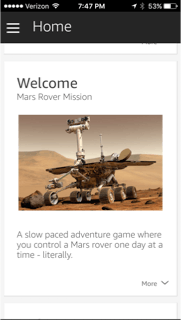

Created December 1, 2016

Mars Rover Mission: A slow paced adventure game.
================================================

We've re-established contact with the Mars Exploration Rover Spirit and restored limited control. You are the Spirit mission manager.

Story
---------------

I’ve been an Amazon Echo owner for about a year and have been interested building something using the Alexa Skills Kit, but never felt I had the right idea. A week before AWS re:Invent, I saw the skills contest and was determined to participate (and hopefully win). I listen to the [Alexa Dev Chat Podcast](https://developer.amazon.com/public/solutions/alexa/alexa-skills-kit/content/alexa-developer-podcast) and knew that voice based adventure games were a growing category. But, could you play an adventure game every day? Then, as I was building out my conference schedule I saw the “How JPL leverages Alexa” session and had my idea: Mars Rover Mission. In this adventure game skill, you assume the role of a Mars Rover Mission Manager. The communications delay with Mars naturally fit with coming back to this skill every day.

The idea was forming, but I wasn't a Mars rover expert (yet), so I started with Wikipedia and then moved on the the excellent NASA websites. It turns out that NASA lost contact with Spirit, also known as MER-A (Mars Exploration Rover – A) in 2010. I now had the details about a real Mars rover, including how little happens every day because of to communications delay, rover speed and energy consumption. I had to balance realism with having an adventure game that is fun to play.

To craft a compelling story, I used an actual image, acquired by the Mars Reconnaissance Orbiter, that shows the [Mars Exploration Rover Spirit's 2006 winter campaign site](https://www.nasa.gov/multimedia/imagegallery/image_feature_963.html). Looking at this photo, I imagined where some exploration paths and waypoints might appear. I built out a map/directed graph to help me build the narrative. From that, I built out the code that could let the user navigate between the different waypoints on my fictional map. (See the attachments below for the final map).

However, little did I know that JPL would be releasing their own NASA Mars skill this week and demonstrating a real rover in their session. Still, I pressed on later into the night, and here is my project.

### Video

### Skill ID

> `amzn1.ask.skill.3ef12585-21e5-4396-a55b-40f0fc900b84`

### Design

The [Alexa Skills Kit SDK for Node.js](https://github.com/alexa/alexa-skills-kit-sdk-for-nodejs) was used to make the coding both easier and faster. The built in DynamoDB session persistence and state aware handlers let me jump right into implementing the idea. The full [source code](https://github.com/kjhsoftware/mars-rover-mission) repository is referenced at the end of this document. The skill was hosted in Lambda and testing with my new Echo Dot.

Amazon S3 was used for hosting image and sound files. The images were used to add cards in the Alexa app. Here is an example:

### Voice User Interface (VUI)

A flowchart representing the VUI diagram is available in the attachments below. I found it useful to try the skill and listen to myself talk. That produced better, and more natural results that trying to pre-plan the conversation.

The small touches help sell the conversational experience. Recalling NASA sound recordings and transcripts, I knew **yes** and **no** questions were often answered using the terms **affirmative** and **negative** - so I added these phrases to the built-in intents:

    AMAZON.YesIntent affirmative 
    AMAZON.YesIntent that's affirmative 
    AMAZON.YesIntent that's affirm 
    AMAZON.NoIntent negative 
    AMAZON.NoIntent that's negative
    

I also download some short MP3 files from the NASA [Audio and Ringtones](https://www.nasa.gov/connect/sounds/index.html) page. As you could hear in the video, these added another touch of polish to the overall experience.

### Testing, Debugging, (and Cheating)

Because Lambda uses [Node.js](http://node.js/) 4.3, I wanted to use some ES2015 language features and turned to [node.green](http://node.green/) for compatibility. However, at one point I got an unhelpful stacktrace in the CloudWatch Logs and was stuck. It wasn't until I did a **Save and Test** from the Lambda console before I could see the real problem:

`Block-scoped declarations (let, const, function, class) not yet supported outside strict mode`

I will definitely be reporting this issue one I'm done with this contest.

Another challenge was testing my slow paced game is that I could not wait an entire martian day for my next turn (and still make the deadline). Therefore, I introduced some cheat codes to help out. I've listed them below, but you will have to try and out (or look at the source code) to see what they do.

> override code Mike Alpha Papa waypoint {Waypoint}

> override code Sierra Oscar Lima

### Conclusion

Little did I know that JPL would be releasing their own NASA Mars skill this week and demonstrating a real rover in their session. Still, I pressed on and coded late into the night. Here is my project. Enjoy.

Schematics
-------------------------

### Voice User Interface (VUI) diagram

### Game Map

Thanks to [NASA](https://www.nasa.gov/multimedia/guidelines/index.html).
